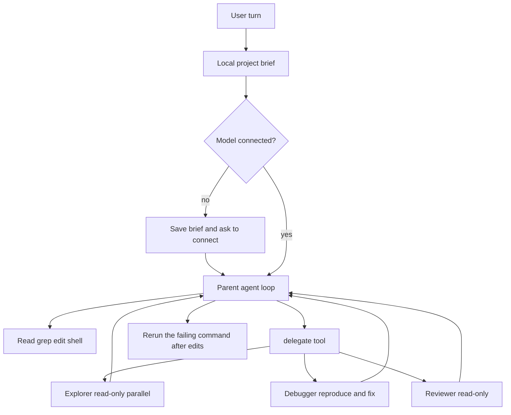

# YamX

YamX (`yamx`) is a terminal coding agent. It starts with no model, runs local commands immediately, and when a model is connected it writes code, edits files, debugs failures, and applies fixes from a local picture of the project.

Version 1.0.30. Node.js 18+.

The prompt is `>`. A pixel **YamX** mark plays on startup, then a card shows the folder, `local · offline` (or the connected model), the session, and the version.

## Start

```bash
npm install -g @needyamin/yamx@latest
yamx
```

From this repository:

```bash
npm install
npm run build
node dist/index.js
```

`npm run dev` starts without a separate build. `npm link` puts `yamx` on your PATH.

YamX opens even when no API key is set. The card reads `local · offline`. Shell lines such as `git status` run on this machine. On Windows, `ip` runs as `ipconfig` and `ps` runs as `tasklist`. Dangerous commands still ask before they run.

Connect a model with `/connect` or `yamx --onboard`. Enter the base URL, API key, and any model name for an OpenAI-compatible chat endpoint (usually a URL ending in `/v1`).

```text
Base URL    https://api.example.com/v1
API key     sk-...          (optional for a local server)
Model name  my-model
```

YamX stores those fields, plus optional extra headers, as `providers.custom` in `~/.yamx/config.json`. Leave the API key blank later to keep the saved key.

```bash
yamx --onboard     # set base URL, API key, and model name
yamx --diagnose    # saved endpoint, git, sessions
yamx web           # local web UI on 127.0.0.1:8765
```

## Coding architecture

A write, fix, or debug turn reads the project from disk first. That brief is what the model and its sub-agents use. Greetings and bare shell lines do not take this path.



The brief always includes the absolute project path, working directory, OS, shell, package manager, the test / lint / build scripts that exist, git branch and dirty state, entry files, and any files named in the error you pasted.

If no model is connected, YamX saves the brief and asks you to `/connect`. The next coding turn sends that brief with the request. The model does not invent paths or commands that are not in the brief or a tool result.

Sub-agents:

| Role | What it does |
| --- | --- |
| explorer | Read, grep, and map the repo. Runs in parallel with other explorers and the reviewer. |
| implementer | Reads, then edits with `edit_file`, `multi_edit`, `patch_file`, or `write_file`. |
| debugger | Reproduces the failure, edits, then reruns the same command. |
| reviewer | Reads `git status` and `git diff`. Does not edit. |

Only one writer runs at a time, and it locks the paths it names. Each child returns a short report (files changed, commands, first error, whether verify passed). The parent does not redo those edits. `/explore`, `/plan`, `/review`, and `/agent` use the same runner.

After a real file edit, the same test or build command is allowed to run again. An unchanged rerun is skipped.

`settings.subagents.maxParallel` defaults to 3. `settings.subagents.maxIterations` defaults to 12.

## Two binaries

| Binary | What it is |
| --- | --- |
| `yamx` | The coding REPL. Sessions, 33 tools, project brief, sub-agents, and any connected model. |
| `ymax` | The offline router. One local expert handles a command. No API key. |

```bash
ymax "git status"
ymax "read package.json"
ymax help
```

## In-session commands

| Command | |
| --- | --- |
| `/help` | List commands |
| `/connect` | Set base URL, API key, and model name |
| `/model` | Provider and model in use |
| `/explore` `/plan` `/review` | Read-only sub-agents |
| `/agent <name> <task>` | Run a built-in or custom sub-agent |
| `/agents` | List sub-agents |
| `/scan [quick\|deep]` | Offline project scan to `.yamx/project-summary.md` |
| `/tools` | List tools |
| `/diff` `/status` | Git diff and session snapshot |
| `/undo` | Revert the last file edits from this turn |
| `/stop` | Stop the current turn |
| `/exit` | Save and quit |

Custom sub-agents are markdown files in `.yamx/agents/` or `~/.yamx/agents/`.

## Built-in tools (33)

- Files: `read_file`, `read_files`, `write_file`, `write_files`, `edit_file`, `list_files`, `search_files`, `delete_file`
- Edits and search: `multi_edit`, `copy_file`, `move_file`, `file_info`, `grep_search`, `directory_tree`, `patch_file`, `find_references`
- Shell: `run_command`, `run_command_background`, `shell_diagnostics`, `task_list`, `task_tail`, `task_stop`
- Git: `git_status`, `git_diff`, `git_commit`, `git_log`, `git_branch`, `git_stash`
- Web and intel: `fetch_url`, `project_intel`, `codebase_analysis`, `log_inspect`
- Crew: `delegate`

Destructive commands and deletes still ask for approval.

## Connect

`/connect`, `yamx --onboard`, and the web Settings → Model page use the same fields: base URL, API key, model name, and optional extra headers. They are stored as `providers.custom`.

Environment overrides: `YAMX_CUSTOM_BASE_URL`, `YAMX_CUSTOM_API_KEY`, `YAMX_CUSTOM_MODEL`.

```bash
yamx -m my-model
```

A saved OpenRouter, OpenAI, or other named provider in an older config does not start. With no base URL, YamX stays offline.

## Configuration

`~/.yamx/config.json` holds providers and settings. Sessions live in `~/.yamx/sessions/`. Project memory lives in `.yamx/`.

Settings that matter for coding:

- `permissionMode` — `default`, `ask`, `read-only`, or `auto-safe`
- `autoApprove`, `allowedShellCommands`, `deniedShellPatterns`
- `subagents.enabled`, `subagents.maxParallel`, `subagents.maxIterations`
- `preflightRuntimeProbes` — local probes before install and diagnose turns
- `streamOutput`, `maxTokens`, `temperature`
- `contextBudgetChars`, `maxToolResultChars`, `maxAssistantMarkdownChars`

```bash
yamx config
yamx --reset-config
```

Remove local data:

```bash
# macOS / Linux
rm -rf ~/.yamx

# Windows PowerShell
Remove-Item -Recurse -Force $HOME\.yamx
```

## Web UI

```bash
yamx web
yamx web --host 127.0.0.1 --port 8765
```

The server binds to loopback. `--allow-dangerous` permits risky commands from the browser. The page can chat, switch sessions, and set a model under Settings, Model.

Useful routes: `GET /api/state`, `GET /api/sessions`, `POST /api/chat`, `POST /api/command`, `GET /api/tools`.

## CLI reference

```text
yamx [options]
```

- `-m, --model` — model name sent to the saved endpoint
- `-t, --temperature`
- `--max-tokens`
- `--auto-approve`
- `--no-stream`
- `--new-chat`, `--resume <id>`, `--history`, `--clear-chat`, `--delete-chat <id>`
- `--onboard`, `--reset-config`, `--diagnose`

Subcommands: `yamx config`, `yamx web`.

## Develop

```bash
npm install
npx tsc -p config/tsconfig.json
npm test
npm run dev
```

On Windows, `npm.cmd` is the script runner if PowerShell blocks `npm`.

```text
src/index.ts            yamx REPL
src/agent.ts            parent tool loop
src/subagents.ts        explorer, implementer, debugger, reviewer
src/project-intel.ts    coding brief
src/crew-scheduler.ts   parallel readers and writer locks
src/pixel-logo.ts       startup mark
src/ymax.ts             offline router
src/providers/          custom model endpoint and the OpenAI-compatible client
src/tools/              33 tools, including delegate
```

## Troubleshooting

`yamx` is not on PATH: the npm global bin directory must be on `PATH`. Open a new terminal after install.

No model yet: that is the normal start. Use `/connect`. Coding asks wait there until a model is connected. Shell lines still run.

Curl setup rejected: the URL must be `http` or `https` and end in `/v1` or `/chat/completions`.

A command was rewritten badly: short names and shell keywords are not typo-fixed (`ip` stays a network command, not `if`). `/fix` previews a correction. `/translate` shows the native command for this OS.

Build fails with `EPERM` on `dist`: another `yamx` or `node dist/index.js` still has those files open. Stop it, then build again.

## License

ISC — [Yamin](https://github.com/needyamin)
